# ACTION CABLE

One of the best thing about rails is the ease with which it allows you to **develop webapps quickly by providing some sensible defaults.**

And with Rails 5, it allows you to make real time web apps in a breeze

> Introducing Action Cable.. a real time framework for communication over websockets.

But before we proceed any further, let's spend some time discussing how we got to the action cable.. or particularly, the web sockets.

When web started becoming more dynamic with ajax and js advances, we, as developers, started finding ways to make our applications more real-time.

## POLLING

One of the earliest solution that we came up with was Polling.

> Client sends request at regular intervals.
>
 What a simple and robust solution to implement !!

The interval plays a critical role here:

In order to give any real-time experience to the client, ***the polling interval needs to be small*** enough to make the user effectively believe that app is almost live with some network latency may be.

> But there were problems :
>
If we try to make it more realtime by reducing polling interval, our servers didn't like it mainly because of the way the polling.. or rather HTTP works.

Here's a sample implementation from [IBM](http://www.ibm.com/developerworks/library/wa-reverseajax1/)

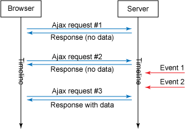


HTTP is a **stateless** protocol. The server and client are aware of each other only during the current request. Afterwards, both of them forget about each other.

Which means... ?

For each request, there is additional data in the form of headers which gets transmitted through the network and therefore, the communication was inefficient.


As per [this google's whitepaper](http://dev.chromium.org/spdy/spdy-whitepaper), typical header sizes of 700-800 bytes is common.

Assuming 800 bytes,

For 1k clients polling every second, network throughput = 800 * 1000 = 0.763 MBps... For 10k clients... 7.63 MBps.

---

## LONG POLLING

Then over the period of time we came up with a little more sophisticated implementations

>The server receives the request and responds only when it has the response available.

Here's a sample implementation from [IBM](http://www.ibm.com/developerworks/library/wa-reverseajax1/)

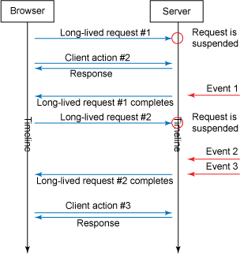

But again, that was not the solution either:
>It quickly falls apart once the data begin to change frequently... that would be more like regular polling itself.

---

## SERVER SENT EVENTS

Server-sent event support was added to Rails in 4.0, through ActionController::Live.
Here's a nice [intro from tenderlove](http://tenderlovemaking.com/2012/07/30/is-it-live.html)

>A persistent unidirectional connnection is made between the server and the client. The client subscribe to the server events via onmessage callbacks.


Here's a [nice write up on server sent events](https://www.packtpub.com/books/content/restful-web-services-%E2%80%93-server-sent-events-sse)

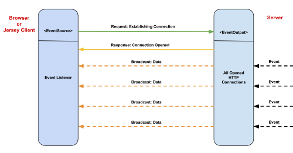

> That seemed promising for a while but the world stopped for IE users. As shown [here](http://caniuse.com/#feat=eventsource), No version of IE implements EventSource interface which is required for server sent events. Whoosh! End of story.


---

## WEB SOCKETS

>Websockets work by maintaining a **persistent bidirectional channel**.
>
After the initial handshake, the http connection is upgraded to a websocket connection. The data frames can then pass to and fro between client and the server until one of the sides closes it.
>
More info [here](https://tools.ietf.org/html/draft-ietf-hybi-thewebsocketprotocol-03#page-5)

Here's a [nice write up on websockets vs REST](https://www.pubnub.com/blog/2015-01-05-websockets-vs-rest-api-understanding-the-difference/)

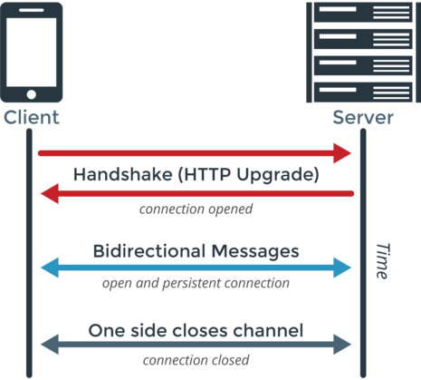

---

### .... Coming back to action cable..

Let's get our head around some common terms that we would be using.

- Consumer - The client of a WebSocket connection is called the **consumer**.

- Channel - A **channel** encapsulates a logical unit of work, similar to what a controller does in a regular MVC setup.

- Subscriber - Each consumer can in turn subscribe (and therefore, will become a subscriber) to multiple cable channels.

---

As seen in the conceptual diagrams below [from here](https://www.zweitag.de/en/blog/technology/lets-build-a-chat-with-actioncable)

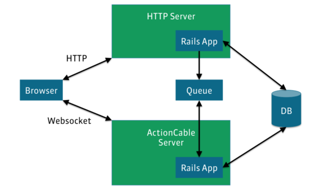

** This is just a bird-eye view. We will be covering the details as we proceed.

> An action cable server can run as a separate server or can be mounted on the Rails App server itself.
>
The action cable server need not to be a threaded server only. More info [here (socket hijacking)](http://old.blog.phusion.nl/2013/01/23/the-new-rack-socket-hijacking-api/)

>A client (Browser) interacts with rails app over HTTP / HTTPS.
>
The connection between client and ActionCable server is upgraded from HTTP to WS / WSS ( WebSocket Protocol ).
>
The Rails App enqueues the publishings in an event queue ( default implementation uses Redis for this)
>
The action cable server processes the queue.

---

## THE RAILS WAY...

When you create a new rails 5 application, rails generates some files for you:

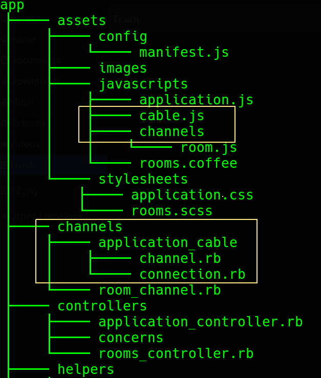

For any implementation of a websocket connection, we need both the client and the server parts of the code.

## CLIENT SIDE

> For the client side you get app/assets/javascripts/cable.js which loads action_cable js and all files in channels directory.

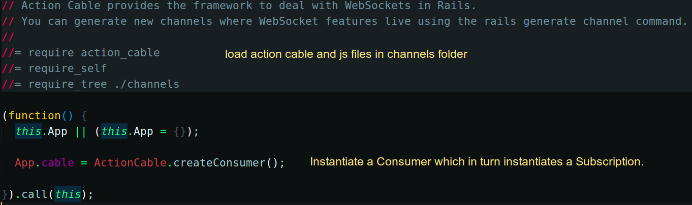

> On page load, a consumer is created and exposed via App.cable.
>
If we would go a little bit into the client side code for action_cable, we would find that rails does all the heavy loading like instantiating subscriptions and connections...monitoring connections etc. pretty cool.. right ?
```javascript
function Consumer(url) {
            this.url = url;
            this.subscriptions = new ActionCable.Subscriptions(this);
            this.connection = new ActionCable.Connection(this);
        }
```

For most practical pusposes, you would not be modifying anything in this file.

## SERVER SIDE

>**Actually rails generates an empty Connection class.**
>However, for almost all practical applications, we would need some sort of authorization on the incoming connections.


###### Here's a good [tutorial on ActionCable devise authentication](http://www.rubytutorial.io/actioncable-devise-authentication/)

```ruby
# SAMPLE IMPLEMENTATION FOR DEMO PURPOSES

module ApplicationCable
  class Connection < ActionCable::Connection::Base
    identified_by :current_user

    def connect
      self.current_user = find_verified_user
      logger.add_tags 'ActionCable', current_user.name
    end

    protected
      def find_verified_user
        # Assuming a successful authentication sets a signed cookie with the `user_id`
        if verified_user = User.find_by(id: cookies.signed[:user_id])
          verified_user
        else
          # Raises ActionCable::Connection::Authorization::UnauthorizedError
          reject_unauthorized_connection
        end
      end
  end
end
```

- Here, `identified_by` is a connection identifier.
Therefore, we can use it to retrieve, and thereby disconnect, all open connections for a given user.

- If you implement a `connect` method, the same is called while handling a websocket open request.

- You can call `reject_unauthorized_access` if you don't want the current_user to connect


The `app/channels/application_cable/channel.rb` contains your **ApplicationCable::Channel** where you put shared logic between your channels.
Similar to ApplicationController for controllers.

---

## SECURING AGAINST CROSS SITE WEBSOCKET HIJACKING

The websockets supports cross domain requests.. which means it is also vulnerable to the security threats which result due to this behavior.
> Rails does all the heavy lifting for you... and all you need to do is some configurations and you are good to go...

> - Action cable only allows requests from origins configured by `action_cable.allowed_request_origins` in your config file.
> - In case of development, this defaults to "http://localhost:3000"
> - You can configure to turn off this check using `disable_request_forgery_protection` in your config file.

```ruby
Rails.application.config
                 .action_cable
                 .allowed_request_origins = ['http://rubyonrails.com', /http:\/\/ruby.*/]

# You can disable this check by :
# Rails.application.config.action_cable.disable_request_forgery_protection = true
```
---

### Message queues via redis... but I don't need them in development...

Yes... the rails community also thought so.

And if you see in the `config/cable.yml`, you'll see the adapter is async instead of redis.

**which means ?**

In your development mode, the message queue is maintained in memory and will be lost once the server is shut down (which is the desired behavior in most development scenarios).

>However, if you want, you may use a redis server as well by uncommenting the `redis` gem in the gem file and configuring `config/cable.yml`

```yaml
development:
  adapter: redis
  url: redis://localhost:6379/1
```

In production, Action Cable uses Redis by default to administer connections, channels, and sending/receiving messages over the WebSocket.

---

## All that came right out of the box.

Let's go ahead and implement a common use case... the chat application.

For a chat application, we would have these three basic requirements:
- We should be able to subscribe to a channel,
- Publish something on that channel
- Receive the published message on the subscribed channel.

## THE `channel` GENERATOR

Rails 5 provides a new `channel` generator which creates two new files.
One ruby file and one js file.

>This generator is similar to the familiar controller generator. You specify the name of the channel (room) and one or more public methods which can be invoked as Remote Procedures ( we'll come it in a while )

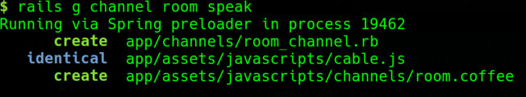
Let's see what we have in each of these files for this particular example..

### CLIENT SIDE JS CODE
```coffeescript
# app/assets/javascripts/channels/room.coffee

App.room = App.cable.subscriptions.create "RoomChannel",
  connected: ->
    # Called when the subscription is ready for use on the server

  disconnected: ->
    # Called when the subscription has been terminated by the server

  received: (data) ->
    # Called when there's incoming data on the websocket for this channel

  speak: ->
    @perform 'speak'
```

> - rails created a subscription for the `RoomChannel`.
>
*Please note that the name is exactly same as the name of the class that we have for channel.*
>
- Then it provides empty implementations for three callbacks: connected, disconnected and received.
>
- Then we have a speak method which basically invokes the perform method with the string `speak` as its argument. again, that name is important.

We'll come to it later that why this naming is important. But the good thing is rails did all that for us and **we don't need to worry about it unless we override the defaults.**

### SERVER SIDE RUBY CODE

```ruby
# app/channels/room_channel.rb
class RoomChannel < ApplicationCable::Channel
  def subscribed
    # stream_from "some_channel"
  end

  def unsubscribed
    # Any cleanup needed when channel is unsubscribed
  end

  def speak
  end
end
```
>For the channel class in ruby,
>
- We have empty implementations for two callbacks, subscribed and unsubscribed.
>
- Also, we have an empty implementation for our speak method.

I think you would appreciate, that we have all this structure ready and we have only typed on one or two generators so far.

### DEMO FROM DHH

[Here](http://www.youtube.com/watch?v=n0WUjGkDFS0)'s the famous action cable demo from DHH, we'll use snippets from there to understand what each portion of code does.

#### SERVER SIDE CODE

```ruby
# app/channels/room_channel.rb
class RoomChannel < ApplicationCable::Channel
  def subscribed
    stream_from "room_channel"
  end

  def speak(data)
    Message.create! content: data['message']
  end
end
```

> - The `subscribed` callback is called whenever a new connection is opened i.e. when you open a new tab.
There's a corresponding `unsubscribed` callback as well which is invoked when a connection is closed.
>
- The [stream_from](http://www.rubydoc.info/github/rails/actioncable/ActionCable%2FChannel%2FStreams%3Astream_from) method is called with the name of the broadcasting pubsub queue ('room_channel' in this case). This name is important and should be same as the one on which the broadcast is invoked.
>
- The `speak` method would be invoked as a remote procedure from the client. Here, we are just creating a new message with the passed args. You may broadcast from here itself, if you want to.
>
However, for all practical applications **we might have large number of subscribers** and it would make sense to handle it asynchronously in a delayed job.

```ruby
# app/models/message.rb
class Message < ApplicationRecord
  # That's a rails 5 equivalent of after_commit, on: :create
  after_create_commit :broadcast_self

  private
    def broadcast_self
      MessageBroadcastJob.perform_later(self)
    end
end
```

And here's the code for the message broadcast job.

```ruby
class MessageBroadcastJob < ApplicationJob
  queue_as :default

  def perform(message)
    # You may render JSON or HTML itself if you want to reuse your views.
    ActionCable.server.broadcast 'room_channel', message: render_message(message)
  end

  private
  def render_message(message)
    # RAILS5_THING: Controller can render partial without being in scope of the controller.
    ApplicationController.renderer
                         .render(partial: 'messages/message', locals: { message: message })
  end
end
```
> Notice how we invoke the [broadcast](http://www.rubydoc.info/github/rails/actioncable/ActionCable%2FServer%2FBroadcasting%3Abroadcast) on a given named named pubsub queue ( the one we passed as argument to `stream_from`) with the hash that we want to broadcast.

#### CLIENT SIDE CODE

Here's a JS equivalent of the coffeescript that was used in the demo.

```javascript
(function() {
  // Subscribe to a channel (RoomChannel)
  // And specify event handlers for various events and any custom actions(speak).
  App.room = App.cable.subscriptions.create("RoomChannel", {
    received: function(data) {
      // Do something when some data is published on the channel
      $('#messages').append(data.message)
    },
    speak: function(message) {
      // We link the client-side `speak` method to `RoomChannel#speak(data)`.
      // This is possible because the server-side channel instance will automatically
      // expose the public methods declared on the class (minus the callbacks),
      // so that these can be reached as remote procedure calls
      // via a subscription's `perform` method.
      return this.perform('speak', { message: message });
    }
  });

  $(document).on('keypress', '[data-behavior="room_speaker"]', function(event) {
    if (event.keyCode === 13) {
      // Respond to some trigger based on which you want to
      // Invoke the speak method on the subscription created above.
      App.room.speak(event.target.value);
      event.target.value = ''
      event.preventDefault();
    }
  });

}).call(this);
```

> I think this snippet explains why the exact string 'speak' was important.
>
That's because, **the server side ruby instance has exposed this method and this can be invoked as Remote procedural call over the websocket connection.**

---

## RUNNING THIS DEMO TO EXPLORE LOGS

Here's the animation showing the working of the demo app.

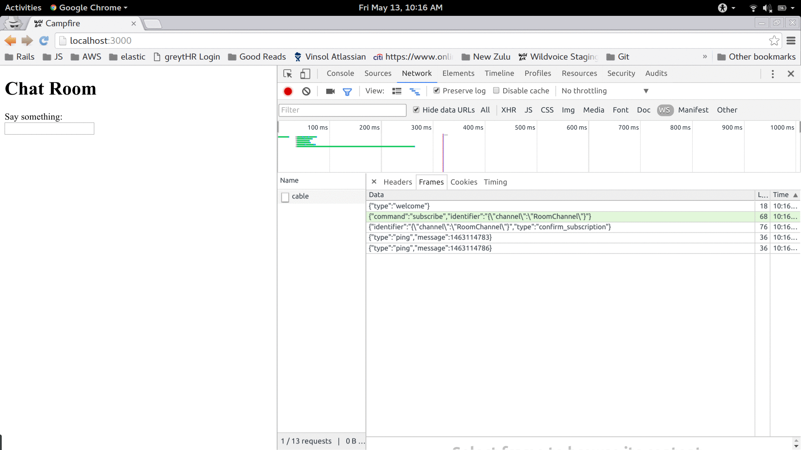

#### WHEN A CLIENT CONNECTS

> Initial handshake and upgrade of HTTP to WebSocket

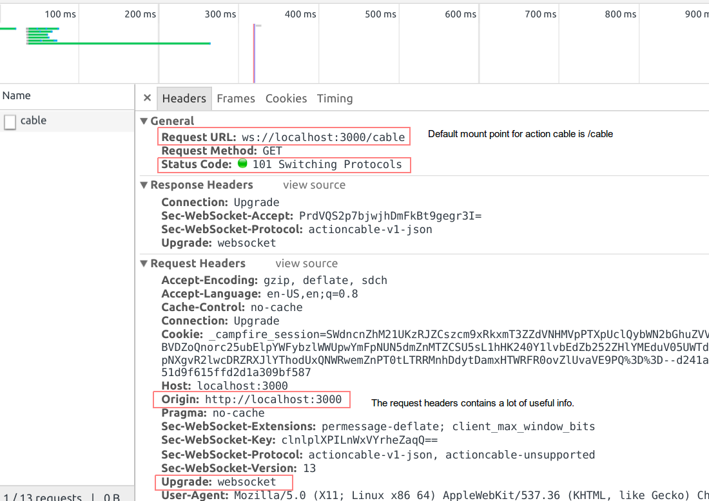

> The client subscribes to a channel

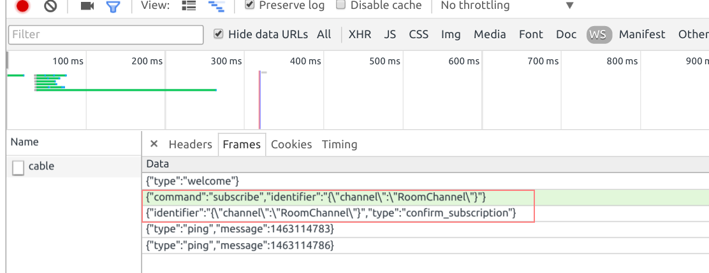

> The server logs also shows the initial HTTP upgrade along with the subscription to the channel.

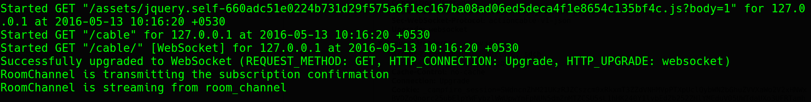

#### WHEN A CLIENT MAKES A RPC AND MESSAGE BROADCASTS.

> The client invokes the channel's `speak` method which in turn results in a broadcast along the channel as seen in the returned frame.

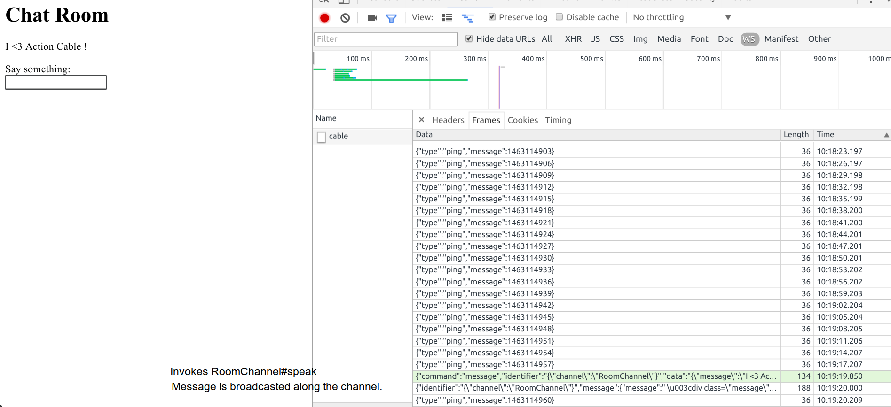

> The server logs show the invocation of RoomChannel#speak followed by its persistence in db and broadcast along the channel.

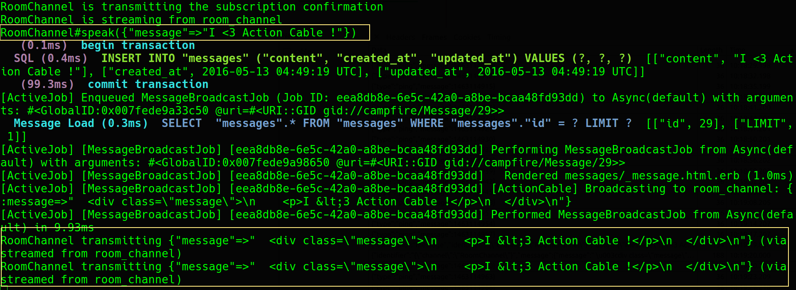
---

So that was a brief intro to the Action Cable which fills in the gap for realtime features in rails. Hope you found it interesting. Thanks for reading.
